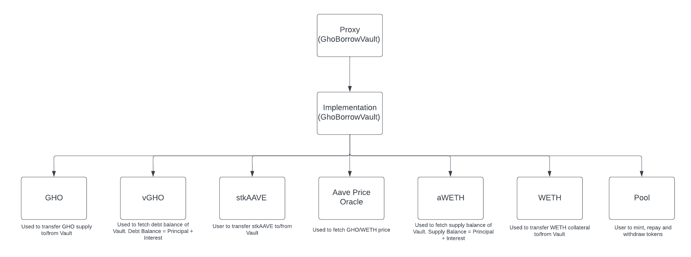

# AAVE GHO Pool

This project demonstrates design of smart contracts system that allows stkAave holders to sell their discount on GHO borrow rate.

To run the forked e2e tests you need to get RPC URL from Alchemy for Goerli testnet. Then copy it to the `.env.example` file. After than run the following command:

```
cp .env.example .env
npx hardhat test
```

## Technical Spec

The idea is to design a smart contract that will allow users to pool together their stkAAVE to get better discount on GHO borrows. AAVE pool natively doesn't allow this feature so we need to design a custom solution.

The StakedTokenV2Rev4 contract automatically applies discount to borrow rate in vGHO for accounts that hold stkAAVE. Whenever accounts stkAAVE balances change it automatically adjusts the borrow rate for GHO. 

We will cretae a GhoBorrowVault contract that will act as a custody for stkAAVE tokens of the users who want to pool together. Now GhoDiscountRateStrategy will provide discount to the contract address as the contract owns the tokens. Therefore we need to build a mechanism such that the contract will supply/borrow onbehalf of users. From AAVE point of view it's just one user supplying and borrowing. 

For now we want to enable users to only deposit WETH as collateral and borrow GHO at 50% LTV ratio. So if a user supplies $100 worth of WETH it will give the user $50 worth of GHO. 1 GHO is always equals to $1 therefore it will send 50 GHO to the user. Similarly we will also allow the user to anytime return the borrowed GHO and claim back the total collateral. 

### Supply and Borrow Interest

When you supply to aToken or borrow from vToken there is a interest accrued real time. The `balanceOf` method of aToken and vToken return principal amount + interest. The amount this function returns keeps increasing every block. We need to find a way to calculate each individual users supply and borrow interest based on their supply and borrow. To achieve this we will use indexes based interest distribution mechanism.

So basically whenever there is a deposit/borrow/stake to the GhoBorrowVault contract we will find out the total borrow and supply interest on the total holdings. And then divide it by total borrow and supply respectively. This way we will get interest per borrowed and supplied token. 

```
globalBorrowIndex += totalBorrowInterest / totalBorrows
globalSupplyIndex += totalSupplyInterest / totalSupply

totalSupplyInterestAccrued = totalSupplyInterest
totalBorrowInterestAccrued = totalBorrowInterest
```

The total supply and borrow interest will keep growing and when we update the index next time we only want to include the new interest accrued. That's why we record totalSupplyInterestAccrued and totalBorrowInterestAccrued. And next time when calculating indexes we can use the newly accrued interest as such:

```
globalBorrowIndex += (totalBorrowInterest - totalBorrowInterestAccrued) / totalBorrows
globalSupplyIndex += (totalSupplyInterest - totalSupplyInterestAccrued) / totalSupply

totalSupplyInterestAccrued = totalSupplyInterest
totalBorrowInterestAccrued = totalBorrowInterest
```

And when a user starts borrowing from the vault, we record the global indexes for the user. Then when calculating the interest for the user we don't charge the previous interest accrued before the user joined the vault. 

```
userBorrowIndex = globalBorrowIndex
userSupplyIndex = userBorrowIndex
```

Finally when user repays the borrow we rebase the totalSupplyInterestAccrued and totalBorrowInterestAccrued to current interest so that we consider only newly accrued interest after the repay for distribution among users

### Liquidation

We also need to provide a liquidation mechanism such that if a user's debt exceeds a 60% threshold then anyone can liquidate the user's collateral by repaying the debt. There should be a liquidation incentive of 1% to incentivize liquidations. Let's take an example to understand the liquidation system:

Suppose a user supplies 10 WETH then here is the metrics:

```
Total Supply: 10 WETH
WETH Price: $4000
Total Supply in USD: 40,000 WETH
Total Borrow (50% of total supply): 20,000 GHO
```

Now uppose the price of WETH drops to $3500 then:

```
Total Supply: 10 WETH
WETH Price: $3500
Total Supply in USD: 35,000 WETH
Total Borrow: 20,000 GHO
Liquidation Threshold (60%) = 60% of (total supply in USD) = 21,000 
```

So the total borrow available is 21,000 GHO whereas user has borrowed 20,000 GHO so a liquidation will be rejected.

Now suppose price drops to $3000 then:

```
Total Supply: 10 WETH
WETH Price: $3000
Total Supply in USD: 30,000 WETH
Total Borrow: 20,000 GHO
Liquidation Threshold (60%) = 60% of (total supply in USD) = 18,000
```

In this case the total borrow allowed is 18,000 GHO whereas user has borrwed 20,000 GHO therefore anyone can liquidate the user account. Here is the balances calculations for liquidations:

```
Repay Amount (100%) = 20,000 GHO
Repay Amount in WETH = 20000/3000 = 6.67
Incentive (1%) = 1% of 6.67 = 0.0667
Total WETH bought by liquidator = 6.67 + 0.0667 for 20,000 GHO
Total WETH sent to original user = 10 - 6.67 - 0.0667
```

### Architecture

Here is the architecture of the GhoBorrowVault contract. It shows the interaction with other contracts and the purpose of interaction.

